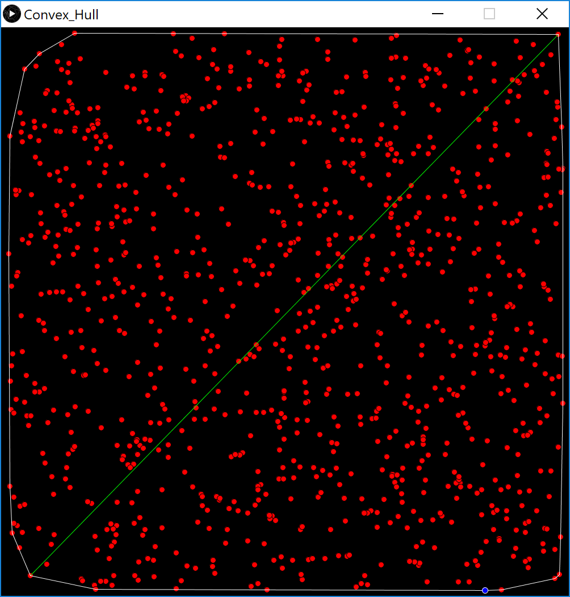
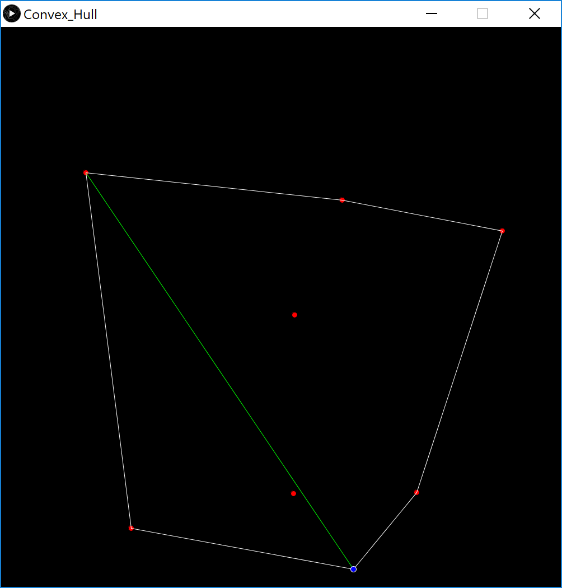

# Farthest-Pair

Uses the [Graham Scan](https://en.wikipedia.org/wiki/Graham_scan) algorithm to create a convex hull and find the two farthest points on a 2D plane. After finding the convex hull, it brute forces the two points that are furtherest apart (a better method would be using [rotating calipers](https://en.wikipedia.org/wiki/Rotating_calipers)). This algorithm will always have either a quicker or same runtime compared to the brute force method without finding the convex hull.

## Requirements

* Processing (version 3 or newer)

## Installing

Simply open "Convex_Hull.pde" in the "Convex_Hull" folder through Processing and run.

## Instructions

The program is defaulted to using an array of random points. If you'd like, you can simply change the `inputHull` variable in `setup()` to your own desired array of points (must use [PVector](https://processing.org/reference/PVector.html) class as points). 

After executing the program, it should return the computation time (ms), coordinates of the two farthest points, and create a visual representaion of the convex hull (white line) and said points (green line).

## Screenshots

## Time Complexity

The worst case runtime for computing the convex hull is logrithmic time, while the worst case runtime for brute forcing the two farthest points using the convex hull is quadratic time (rotating calipers is linear time).

## Built With

* Processing

## Author(s)

* Bob Huang
